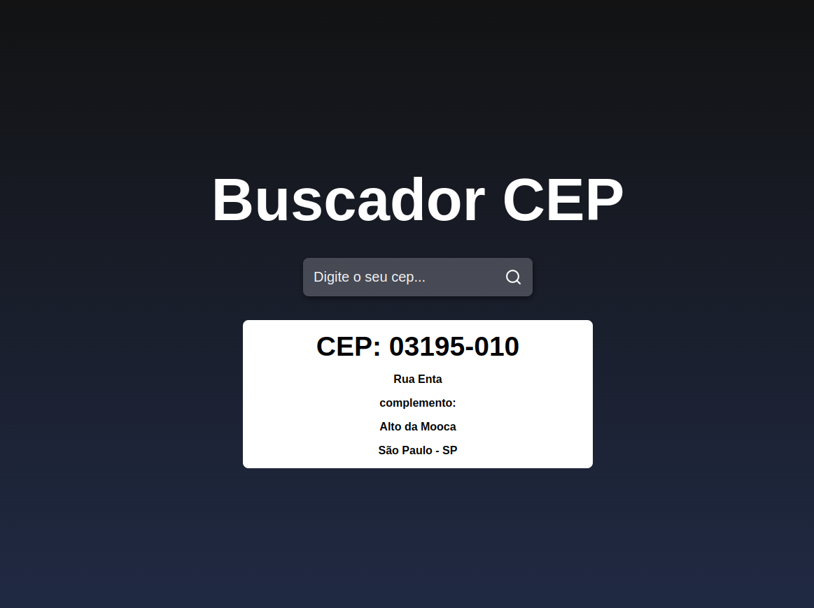
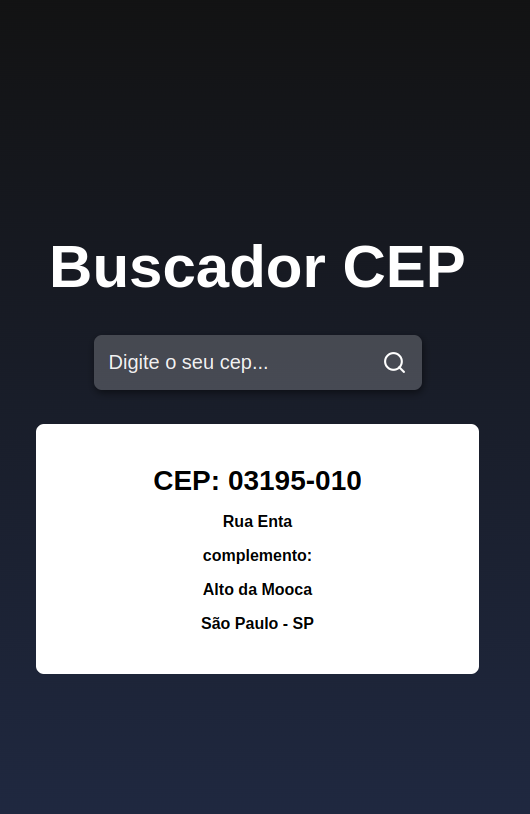

  <a href="#tecnologias">Tecnologias</a>&nbsp;&nbsp;&nbsp;|&nbsp;&nbsp;&nbsp;
  <a href="#-projeto">Projeto</a>&nbsp;&nbsp;&nbsp;|&nbsp;&nbsp;&nbsp;
  <a href="#-como-rodar">Como rodar</a>&nbsp;&nbsp;&nbsp;|&nbsp;&nbsp;&nbsp;
  <a href="#-como-contribuir">Como contribuir</a>&nbsp;&nbsp;&nbsp;
  

 

  

  

## Buscador de CEP

## 🚀 Tecnologias

Esse projeto foi desenvolvido com as seguintes tecnologias:

- [React](https://pt-br.reactjs.org/) - 18.2.0
- [Npm](https://www.npmjs.com/) - 8.19.2

## 💻 Projeto

Projeto é um buscador de CEP usando a API ViaCep.

Projeto do canal [Sujeito programador](https://www.youtube.com/watch?v=oy4cbqE1_qc).

## 🚀 Como Rodar

- Clone o projeto.
- Entre na pasta do projeto e rode npm install (pode usar yarn install de acordo com a sua configuração).
- Entre na pasta do projeto e rode npm start.

## 🤔 Como contribuir

- Faça um fork desse repositório;
- Cria uma branch com a sua feature: `git checkout -b minha-feature`;
- Faça commit das suas alterações: `git commit -m 'feat: Minha nova feature'`;
- Faça push para a sua branch: `git push origin minha-feature`.

Depois que o merge da sua pull request for feito, você pode deletar a sua branch.

## 📝 Licença

Esse projeto está sob a licença MIT.